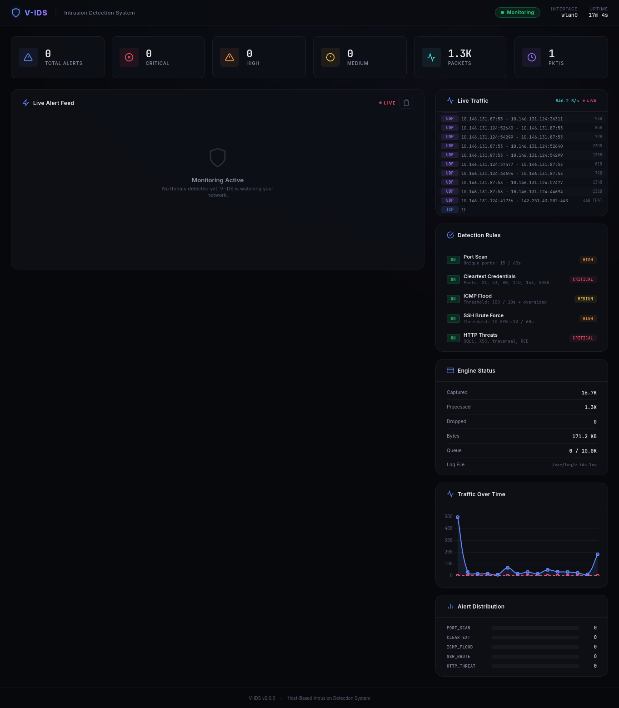
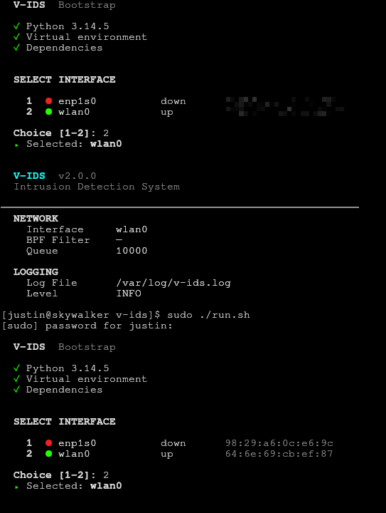
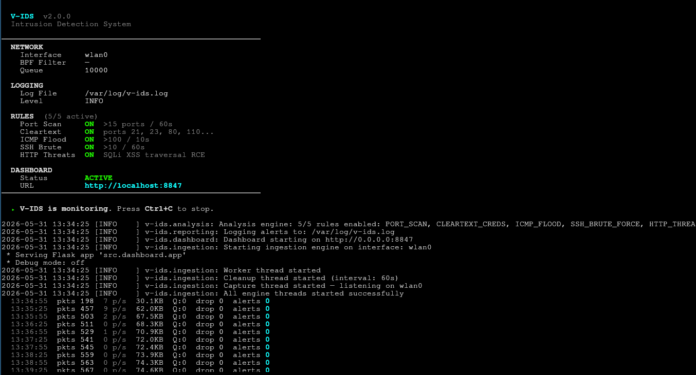

# V-IDS — Intrusion Detection System

> A lightweight, host-based network intrusion detection system (HIDS) with a real-time web dashboard, built with Python 3 and Scapy.

```
╔══════════════════════════════════════════════════════════════╗
║   ██╗   ██╗      ██╗██████╗ ███████╗                         ║
║   ██║   ██║      ██║██╔══██╗██╔════╝                         ║
║   ██║   ██║█████╗██║██║  ██║███████╗                         ║
║   ╚██╗ ██╔╝╚════╝██║██║  ██║╚════██║                         ║
║    ╚████╔╝       ██║██████╔╝███████║                         ║
║     ╚═══╝        ╚═╝╚═════╝ ╚══════╝                         ║
║   V-IDS Intrusion Detection System                           ║
╚══════════════════════════════════════════════════════════════╝
```

## Overview

V-IDS captures live network traffic in promiscuous mode, dissects protocol headers (IPv4, TCP, UDP, ICMP), and identifies malicious activity using heuristic detection rules. Includes a real-time web dashboard for visual monitoring.

## Screenshots

**Real-Time Web Dashboard**


**CLI Interface**

<br>


## Architecture

```
┌─────────────┐    ┌──────────────┐    ┌──────────────┐    ┌──────────────┐
│  INGESTION  │───▶│  DISSECTION  │───▶│   ANALYSIS   │───▶│  REPORTING   │
│   ENGINE    │    │   ENGINE     │    │   ENGINE     │    │   ENGINE     │
│             │    │              │    │              │    │              │
│ scapy.sniff │    │ IP/TCP/UDP/  │    │ Port Scan    │    │ Colorized    │
│ BPF filter  │    │ ICMP parsing │    │ Cleartext    │    │ stdout +     │
│ Queue-based │    │ PacketInfo   │    │ ICMP Flood   │    │ log file +   │
└─────────────┘    └──────────────┘    └──────────────┘    │ dashboard    │
     ▲                                       │              └──────┬───────┘
     │              Async Queue              │                     │
     └───────────── (thread-safe) ──────────┘                      ▼
                                                          ┌──────────────┐
                                                          │  WEB DASH    │
                                                          │  Flask +     │
                                                          │  SocketIO    │
                                                          │  Real-time   │
                                                          └──────────────┘
```

## Features

| Rule | Severity | Description |
|---|---|---|
| **PORT_SCAN** | 🟠 HIGH | Detects >20 TCP SYN packets from a single IP within 10s |
| **CLEARTEXT_CREDS** | 🔴 CRITICAL | Detects `USER`, `PASS`, `password=` in HTTP/FTP traffic |
| **ICMP_FLOOD** | 🟡 MEDIUM | Detects >50 ICMP Echo Requests from a single IP within 5s |

All thresholds are configurable via `config/default.yaml`.

### Web Dashboard
- Real-time alert feed via WebSocket
- Live Traffic Feed (shows protocol, ports, sizes)
- Traffic Over Time Graph (Packets/min and Alerts/min)
- Statistics cards (total, critical, high, medium, packets, pkt/s rate)
- Detection rules status panel
- Engine performance metrics (bytes, queue depth, packets)
- Alert distribution visualization
- Dark theme with glassmorphism design

## Quick Start

### One-Command Launch (Recommended)

```bash
# Auto-installs dependencies, creates venv, and launches V-IDS
sudo ./run.sh
```

The bootstrap script (`run.sh`) automatically:
1. Checks for Python 3
2. Creates a virtual environment (`.venv/`)
3. Installs all dependencies
4. Launches V-IDS with the web dashboard

### Manual Setup

```bash
python3 -m venv .venv
source .venv/bin/activate
pip install -r requirements.txt

sudo .venv/bin/python -m src.main
```

### CLI Options

| Flag | Description | Default |
|---|---|---|
| `-i, --interface` | Network interface to sniff on | Auto-detect |
| `-l, --log-file` | Path to alert log file | `/var/log/v-ids.log` |
| `-c, --config` | Path to YAML config file | `config/default.yaml` |
| `-v, --verbose` | Enable debug output | `False` |
| `--no-color` | Disable colorized output | `False` |
| `--no-dashboard` | Disable web dashboard | `False` |
| `--dashboard-port` | Web dashboard port | `8847` |
| `--version` | Show version | — |

## Web Dashboard

The dashboard launches automatically on **http://localhost:8847** (configurable).

Access it in your browser while V-IDS is running to see:
- Live alert feed with real-time WebSocket updates
- Live scrolling traffic feed showing network flow
- Dynamic line charts tracking packet and alert rates
- Alert statistics and severity distribution
- Detection rule configuration status
- Engine performance (captured/processed/dropped packets, bytes, queue depth)

Disable with `--no-dashboard` flag.

## Alert Format

```
[2026-05-31 10:30:15] [HIGH] [PORT_SCAN] - Src: 192.168.1.50:N/A -> Dst: 192.168.1.1:22
[2026-05-31 10:30:16] [CRITICAL] [CLEARTEXT_CREDS] - Src: 10.0.0.5:43210 -> Dst: 10.0.0.1:21
[2026-05-31 10:30:17] [MEDIUM] [ICMP_FLOOD] - Src: 172.16.0.100:N/A -> Dst: 172.16.0.1:N/A
```

## Testing

### Unit Tests

```bash
source .venv/bin/activate
python -m pytest tests/ -v
```

### Self-Attack Tests

```bash
# Use the included test script from a VM/second machine:
chmod +x scripts/test_attack.sh
sudo ./scripts/test_attack.sh <target-ip>
```

## Running as a systemd Service

```bash
sudo cp v-ids.service /etc/systemd/system/
sudo systemctl daemon-reload
sudo systemctl enable v-ids
sudo systemctl start v-ids

# Check status
sudo systemctl status v-ids
sudo journalctl -u v-ids -f
```

## Project Structure

```
v-ids/
├── run.sh                       # Auto-bootstrap & launch script
├── README.md                    # This file
├── CHANGELOG.md                 # Development log
├── requirements.txt             # Python dependencies
├── setup.py                     # Package setup
├── v-ids.service                # systemd unit file
├── config/
│   └── default.yaml             # Tunable configuration
├── src/
│   ├── __init__.py              # Package metadata
│   ├── main.py                  # CLI entry point
│   ├── ingestion.py             # Packet capture engine
│   ├── dissection.py            # Protocol parsing
│   ├── analysis.py              # Threat detection rules
│   ├── reporting.py             # Logging & output
│   ├── config_loader.py         # Config management
│   └── dashboard/               # Web dashboard
│       ├── __init__.py
│       ├── app.py               # Flask + SocketIO server
│       ├── templates/
│       │   └── index.html       # Dashboard HTML
│       └── static/
│           ├── css/style.css    # Dashboard styles
│           └── js/dashboard.js  # Dashboard client logic
├── tests/
│   ├── test_dissection.py       # Dissection unit tests
│   ├── test_analysis.py         # Analysis rule tests
│   ├── test_reporting.py        # Reporting format tests
│   └── test_dashboard.py        # Dashboard & API tests
└── scripts/
    └── test_attack.sh           # Self-test attack script
```

## Technology Stack

- **Python 3.8+** — Core language
- **Scapy** — Packet capture & protocol dissection
- **Flask + Flask-SocketIO** — Real-time web dashboard
- **Chart.js** — Traffic visualization charts
- **PyYAML** — Configuration management
- **Colorama** — Cross-platform terminal colors
- **pytest** — Testing framework
